# BudgetMate
A personal finance tracker that helps users track income and expenses, in order to gain financial insights.
## Project Description
This app has been developed as a university project for the course called Web Programming 2. During the development of this app I have done more than just code, creating user stories, personas, system diagrams, data flow charts and created UI prototypes, doing all of these in order to simulate the real SDLC of an enterprise projecet.  

That web app is developed using Spring Boot (Java) for backend and for frontend features server side content rendering using Thymeleaf.

"BudgetMate" is a web application designed to help users manage their personal finances effectively. The platform allows users to track their income and expenses, set budgets, and gain insights into their spending habits. 

The project contains elements/features like:
- Security: authentication and authorization (via Spring Security)
- RBAC (role based access control): allows data separation and feature delimitation for different users (e.g. admin, user)
- Hibernate JPA: object relational mapping allows future DB migration without refactoring stuff
- UI: a static user interface provides clear, efficient and beautiful aesthetics, with the help of Thymeleaf, Bootstrap and JavaScript
- DevOps: project containerized using Docker, ready for deployment
- Testing: test files can be observed in scr/test directory

**OBS:** The UI was initially make in pure HTML + Bootstrap. I later decided to use Thymeleaf, for code clarity, code security and since I became more and more familiar with Thymeleaf and MVC as the time passed by.

# Tech Stack
**Backend**: Java, Spring Boot, Spring Security.  

**Frontend**: HTML, CSS, JavaScript.  

**Deployment**: Docker, Docker Compose.

## User Interface

The app lets you add expenses, give an unique name for each one, a date and a category to be a part of. Here, we paid for car Fuel, 150, and checked Transport category. Let's upload it.
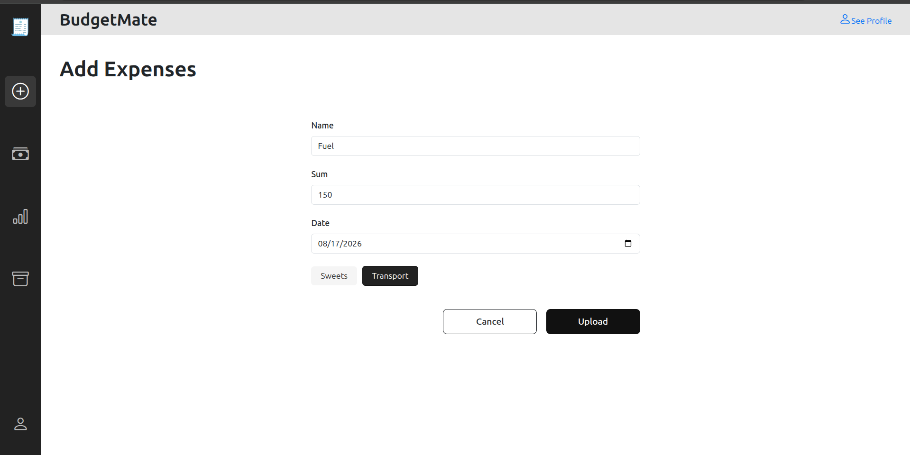

If we look over the dashboard of the app, in August, we can see that we have spent some amounts of money on Sweets and another amount on Transport. The 250 total for Transport is represented by 100 (old expense)+ 150 (Fuel, just added by us). So the app keeps track of the total expenses for each category and for total expenses for all categories summed.
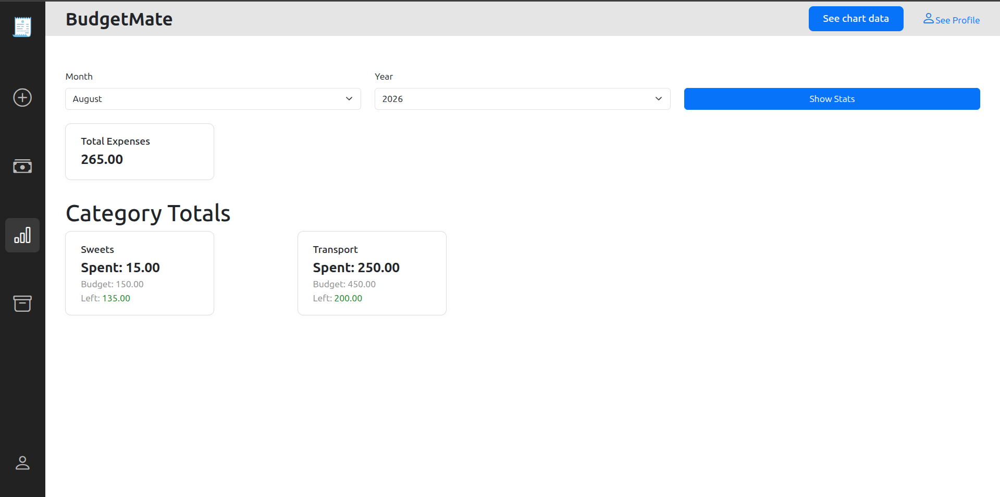

You can create your own custom categories for your needs. Here we want to register money for Trips, so we need this new Category for Trips. I have also inserted a budget for this category (monthly budget).
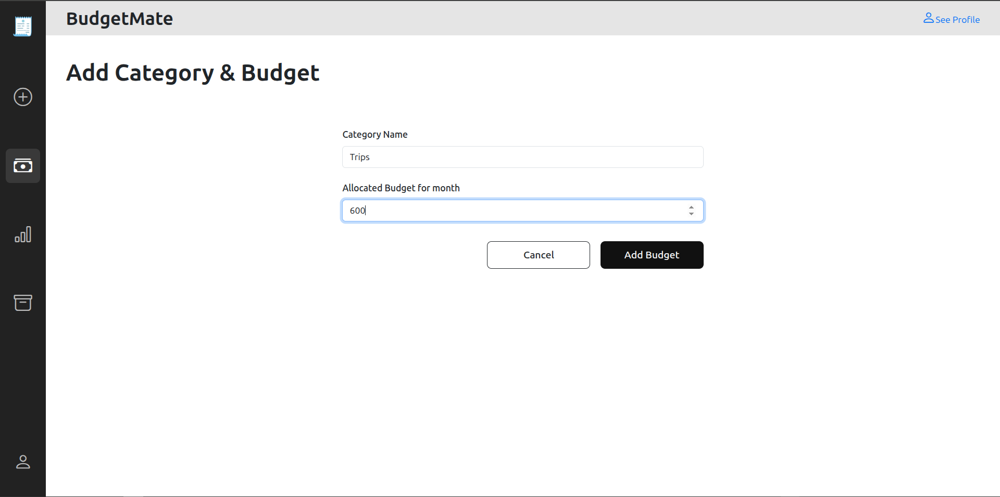

I have replaced the default Spring Security credentials and login page. Our custom design is more suitable than the standard UI of Spring Security. You can see more about permissions and default pages in src/main/java/com.budgettracker/config/SecurityConfig.java.

Login Page:
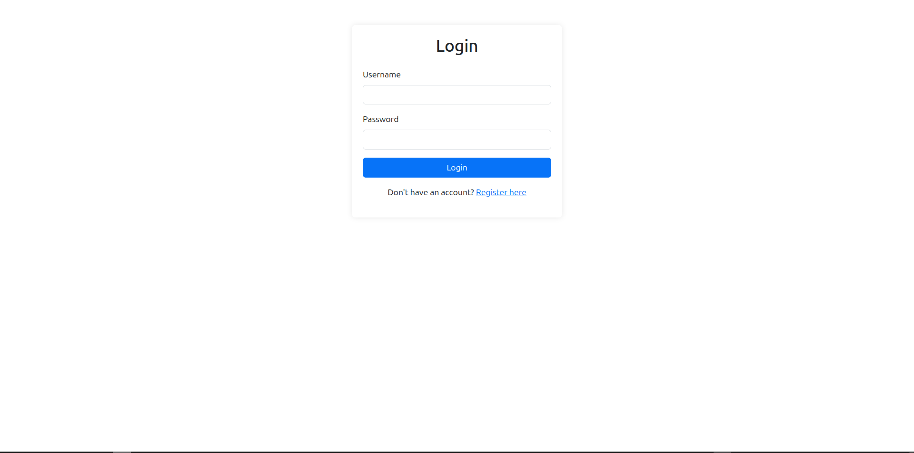

Register Page:
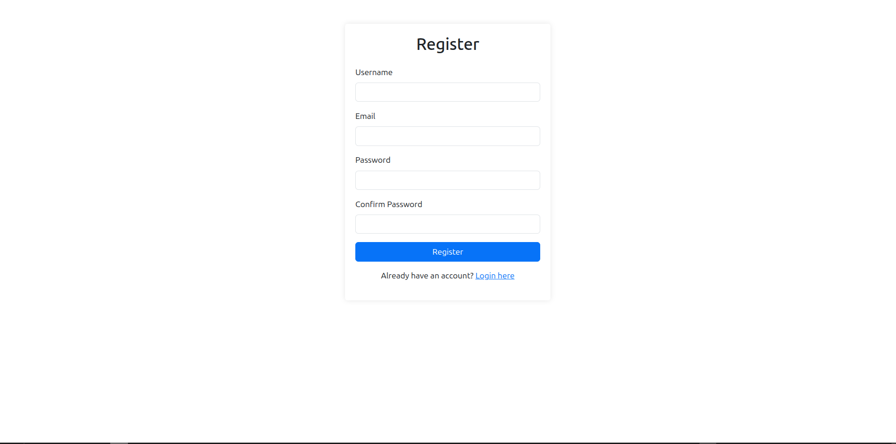

There are also some other functions that are easy to use and understand. They might help the user and create a better experience on the platform.

Some of them are: Analytics for data, profile management, or data archives. I have pasted some screenshots of them right here:

Here we can see a chart that describes better our financial expenses.
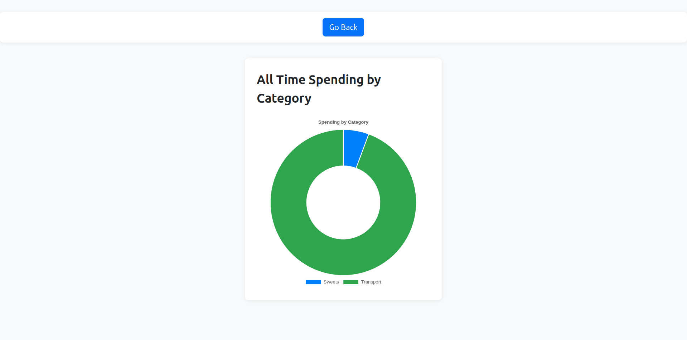

This profile management page enable credentials update for users.
The profile picture upload stores the uploaded image on the server, while the User table only holds the global path of the image (in String format, so no binary data in the SQL table). By doing so, we do not waste RAM on loading binary resources from the database. 
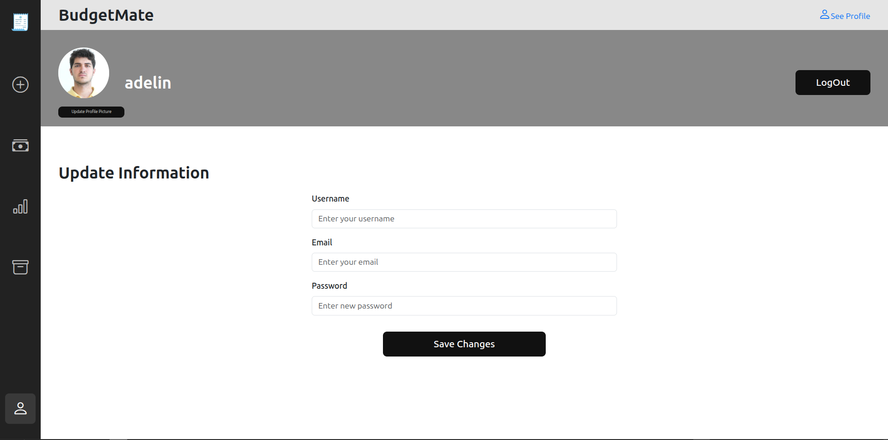

The archive function enables users to save files that are important to them.
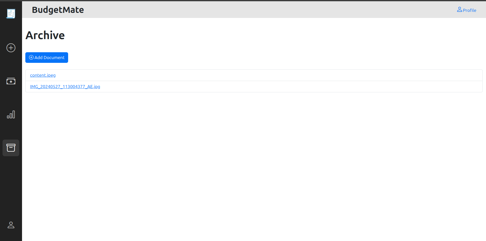

# Role based authentication

The app checks if you are a regular user or an admin. It also verifies if the role is "ADMIN" or "ROLE_ADMIN", since some people are user to using "ROLE_name", while others who come from Js dev. might be using only "ADMIN", or "USER" al a role name.

Login and Register is available for any kind of users, authenticated or not. When you Login, the site checks your role and redirects you to pages related to your role.
For example, down below I will paste some screenshoots of the ADMIN user interface.

The admin has this "welcome page" that lets him know what's happening.
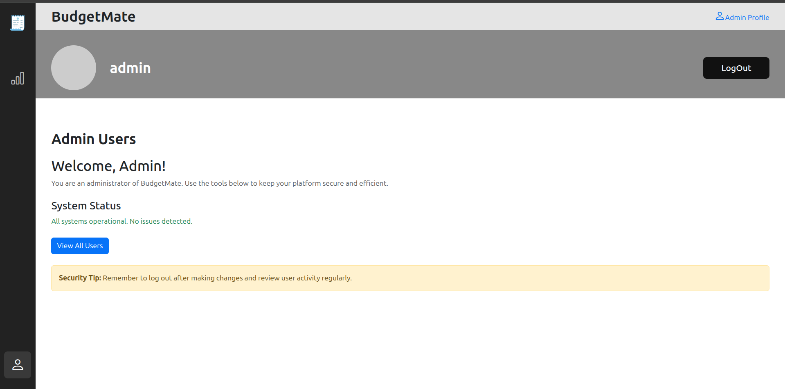

He can see all the users and delete their accounts if needed. This waterfall deletion process is easier to do in SQL than in document type databases (this is another plus for structured DBs).
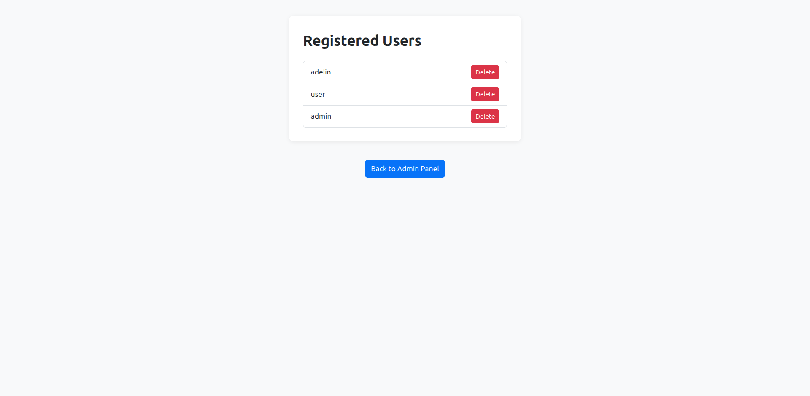

The admin can see an overview of the expenses registered in the platform.
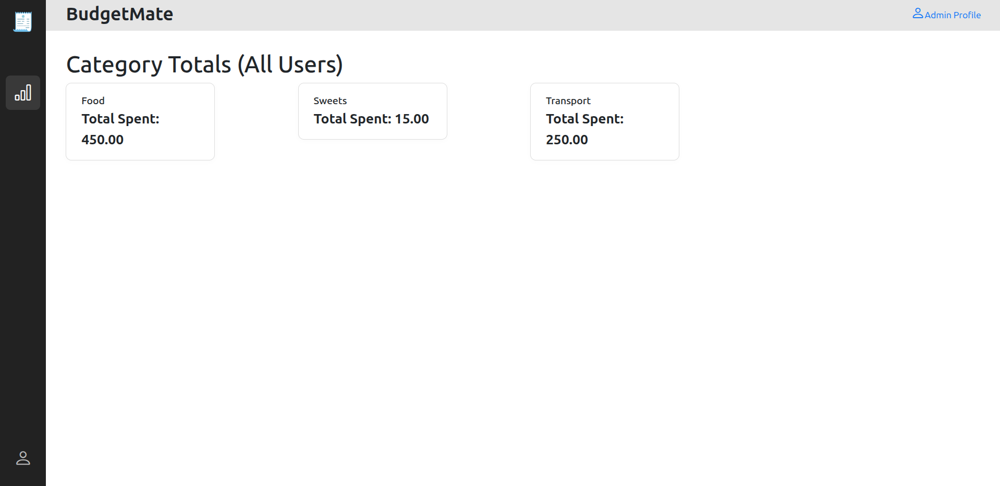

## User Stories

During development, it is important to understand what kind of app we want to develope. For this project, I have build user stories, prototypes, user personas and Trello boards to support the development process.

1. Tracking Expenses: 
**As a** user, **I want to** add and categorize my daily expenses **so that** I can track where my money is going.

2. Setting a Budget:
**As a** user, **I want to** set monthly budgets for different categories **so that** I can manage my spending and avoid overspending.

3. Authentification:
**As a** user, **I want to** log into my account **so that** I can access my data on any device.

4. Having an archive: 
**As a** user, **I want to** upload my financial documents **so that** I can store them safely and organised.

## Admin Stories

1. Modify accounts info:
**As an** admin, **I want to** view a list of all registered users **so that** I can monitor and manage accounts.

2. View platform wide statistics:
**As an** admin, **I want to** see aggregated financial trends and usage statistics **so that** I can analyze how users interact with the platform.

## Figma Prototype
https://www.figma.com/proto/0Jitw7apSztEGr95w674cz/Untitled?node-id=2-2&p=f&t=T9mrvPWRmgsjWW8p-1&scaling=scale-down&content-scaling=fixed&page-id=0%3A1

## Trello Board
https://trello.com/invite/b/67ebc595add333bc02bff77d/ATTI92e6590422c2e9a0cd5c414060e17c395EA76782/budgetmate

---

This project is developed for the Web Programming 2 university subject, during my 3rd year of studies. I have studies **Computers and Information Technology** at Politehnica Bucharest. In total, there were 4 years of studying the IT engineering field.

